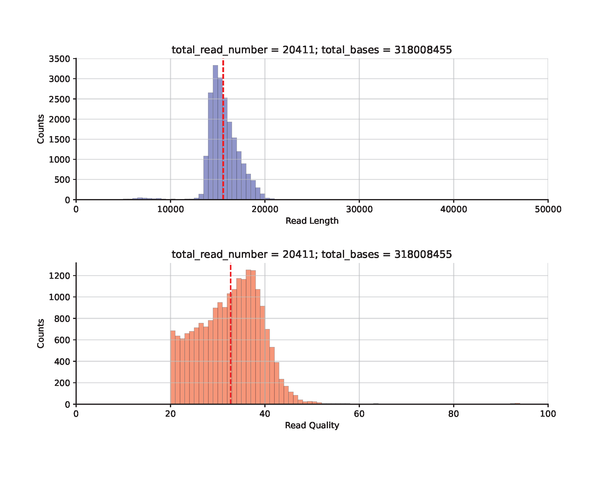
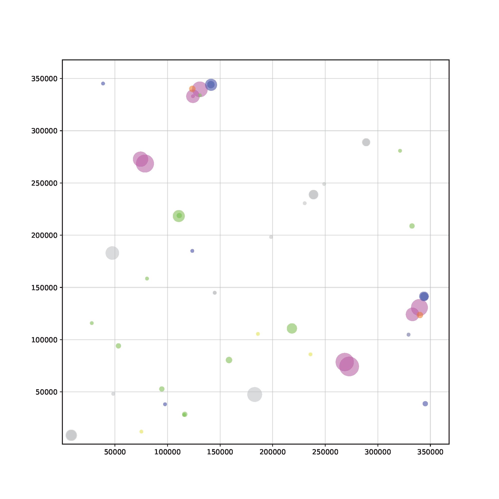
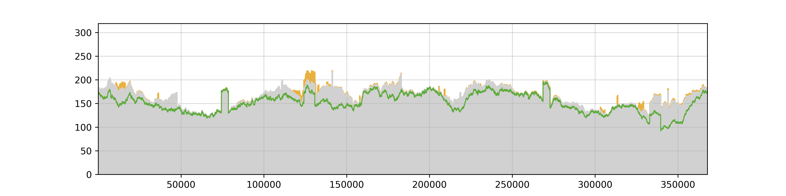

# hifisr

HiFi-SR is a Python-based pipeline for the detection of plant mitochondrial structural rearrangements based on the mapping of PacBio high-fidelity (HiFi) reads or Circular Consensus Sequencing (ccs) data, to a reference genome (i.e., the hypothetical master cycle DNA). HiFi-SR also includes useful scripts for organellar genome analyses.

***We are currently making significant upgrades and modifications to hifisr to enhance its functionality and performance. During this period, please use the old version v.0.2.0, temporarily.***

## Installation

The pipeline has been tested in WSL2 distribution Ubuntu-24.04. It shall work in other Linux operating system, such as CentOS.

### Create a Python Virtual Environment and install required packages

#### Create and activate a venv environment

```bash
# /mnt/software/sys/python/python-3.13.1/bin is your path to the python executable
# /mnt/software/scripts/hifisr in the virtual environment directory
mkdir /mnt/software/scripts/hifisr
/mnt/software/sys/python/python-3.13.1/bin/python3.13 -m venv /mnt/software/scripts/hifisr
source /mnt/software/scripts/hifisr/bin/activate
```

#### Install packages using your local mirror of pypi

```bash
pip install -i https://mirrors.aliyun.com/pypi/simple/ biopython pysam pandas numpy openpyxl matplotlib
```

### Install other dependencies

#### Create a folder to install third-party softwares

```bash
mkdir deps && cd deps
touch soft_paths.txt
```

#### Add the paths of all required software in soft_paths.txt

```bash
# Contents of soft_paths.txt: A TAB-delimited File containing software names, and the path to the executable.
# If your have the softwares installed, add them directly to the file.
# Otherwise, you can install new versions of them.
python	/mnt/software/scripts/hifisr/bin/python
minimap2	/mnt/software/scripts/hifisr/deps/minimap2-2.28_x64-linux/minimap2
samtools	/mnt/software/scripts/hifisr/deps/samtools/samtools-1.21/bin/samtools
seqkit	/mnt/software/scripts/hifisr/deps/seqkit
mecat	/mnt/software/scripts/hifisr/deps/MECAT2/Linux-amd64/bin/mecat.pl
blastn	/mnt/software/scripts/hifisr/deps/ncbi-blast-2.16.0+/bin/blastn
bcftools	/mnt/software/scripts/hifisr/deps/bcftools/bcftools-1.21/bin/bcftools
bamtools	/mnt/software/scripts/hifisr/deps/bamtools-2.5.2/bin/bamtools
meryl	/mnt/software/scripts/hifisr/deps/meryl-1.4.1/bin/meryl
winnowmap	/mnt/software/scripts/hifisr/deps/Winnowmap-2.03/bin/winnowmap
pigz	/mnt/software/scripts/hifisr/deps/pigz/pigz
```

#### Install minimap2

```bash
cd /mnt/software/scripts/hifisr/deps
curl -L https://github.com/lh3/minimap2/releases/download/v2.28/minimap2-2.28_x64-linux.tar.bz2 | tar -jxvf -
```

#### Install samtools

```bash
wget -c https://github.com/samtools/samtools/releases/download/1.21/samtools-1.21.tar.bz2
tar -xjf samtools-1.21.tar.bz2
cd samtools-1.21
autoheader
autoconf -Wno-syntax
./configure --prefix=/mnt/software/scripts/hifisr/deps/samtools/samtools-1.21
make -j 20
make install
cd ..
rm -rf samtools-1.21 samtools-1.21.tar.bz2
```

#### Install seqkit

```
# choose the correct executable for your platform
wget -c http://app.shenwei.me/data/seqkit/seqkit_linux_amd64.tar.gz
tar -zxf seqkit_linux_amd64.tar.gz
rm seqkit_linux_amd64.tar.gz
```

#### Install mecat

```bash
git clone https://github.com/xiaochuanle/MECAT2.git
cd MECAT2
make -j 20
```

#### install blastn

```bash
wget -c https://ftp.ncbi.nlm.nih.gov/blast/executables/blast+/LATEST/ncbi-blast-2.16.0+-x64-linux.tar.gz
tar -zxf ncbi-blast-2.16.0+-x64-linux.tar.gz && rm ncbi-blast-2.16.0+-x64-linux.tar.gz
```

#### Install bcftools

```bash
wget -c https://github.com/samtools/bcftools/releases/download/1.21/bcftools-1.21.tar.bz2
tar -xjf bcftools-1.21.tar.bz2
cd bcftools-1.21
./configure --prefix=/mnt/software/scripts/hifisr/deps/bcftools/bcftools-1.21
make -j 20
make install
cd ..
rm -rf bcftools-1.21 bcftools-1.21.tar.bz2
```

#### Install bamtools

```bash
wget -c https://github.com/pezmaster31/bamtools/archive/refs/tags/v2.5.2.zip
unzip -zxf v2.5.2.zip && rm v2.5.2.zip 
cd bamtools-2.5.2
mkdir build && cd build
cmake -DCMAKE_INSTALL_PREFIX=/mnt/software/scripts/hifisr/deps/bamtools-2.5.2 ..
make -j 20
make install
```

#### Install meryl

```bash
wget -c https://github.com/marbl/meryl/releases/download/v1.4.1/meryl-1.4.1.Linux-amd64.tar.xz
tar -xJf meryl-1.4.1.Linux-amd64.tar.xz && rm meryl-1.4.1.Linux-amd64.tar.xz
```

#### Install winnowmap

```bash
wget -c https://github.com/marbl/Winnowmap/archive/refs/tags/v2.03.tar.gz
tar -zxf v2.03.tar.gz  &&cd Winnowmap-2.03/
make -j 20
```

#### Install pigz

```bash
wget -c https://zlib.net/pigz/pigz.tar.gz
tar -zxf pigz.tar.gz && rm pigz.tar.gz
cd pigz
make -j 20
```

### Install hifisr to the environment

```bash
# install required packages
pip install -i https://mirrors.aliyun.com/pypi/simple/ setuptools wheel twine
# install using pip
pip install hifisr==0.3.0
# or, install it directly
python setup.py install
```

## Exmaples

### Example 1

#### Prepare the reference sequences of mitochondrial and plastid genomes

```bash
# create your working folder
mkdir -p /mnt/software/scripts/results && cd /mnt/software/scripts/results
# Download the references Col_mito.fa, Col_plastid.fa.
# rotate the reference
python rot_ref.py /mnt/software/scripts/hifisr/deps/soft_paths.txt mito Col_mito.fa
python rot_ref.py /mnt/software/scripts/hifisr/deps/soft_paths.txt plastid Col_plastid.fa
```

#### Prepare the reads (fastq format)

Analyze of an example wild-type *Arabidopsis thaliana* dataset Col-CEN ([ERR6210723](https://www.ncbi.nlm.nih.gov/sra/ERR6210723), 14.6 Gb, [Naish et al., 2021, Science](https://www.science.org/doi/10.1126/science.abi7489))

```bash
# Download the data as Col-CEN.fastq
python get_mtpt_reads.py /mnt/software/scripts/hifisr/deps/soft_paths.txt /mnt/software/scripts/results/mito_rotated_293434.fasta /mnt/software/scripts/results/plastid_rotated_61049.fasta /mnt/software/scripts/results/Col-CEN.fastq ATHiFi001 32
```

| All                                                       | mitochondria                                                        | plastid                                                           |
| --------------------------------------------------------- | ------------------------------------------------------------------- | ----------------------------------------------------------------- |
|  |  |  |

#### Calling and calculating the frequencies of SVs, SNVs and small InDels with plotting

```bash
# generate a sample of 4000 reads for mitochondrial and plastid genome, respectively
seqkit sample -p 0.2 /mnt/software/scripts/results/ATHiFi001/reads/ATHiFi001_mito_f1k.fastq >  /mnt/software/scripts/results/ATHiFi001/reads/sample_
ATHiFi001_mito_f1k.fastq
seqkit sample -p 0.01 /mnt/software/scripts/results/ATHiFi001/reads/ATHiFi001_plastid_f1k.fastq >  /mnt/software/scripts/results/ATHiFi001/reads/sample_
ATHiFi001_plastid_f1k.fastq
# Estimation of variant frequencies
python get_variant_frequency.py /mnt/software/scripts/hifisr/deps/soft_paths.txt ATHiFi001 mito run_1 /mnt/software/scripts/results/mito_rotated_293434.fasta /mnt/software/scripts/results/ATHiFi001/reads/sample_ATHiFi001_mito_f1k.fastq 32
python get_variant_frequency.py /mnt/software/scripts/hifisr/deps/soft_paths.txt ATHiFi001 plastid run_1 /mnt/software/scripts/results/plastid_rotated_61049.fasta /mnt/software/scripts/results/ATHiFi001/reads/sample_ATHiFi001_plastid_f1k.fastq 32
```

| mitochondria                                                        | plastid                                                           |
| ------------------------------------------------------------------- | ----------------------------------------------------------------- |
|  |  |
|  |  |

### Example 2

Recursive identification of large (> 1 kb) and intermediate-sized (50 bp - 1 kb) repeat groups in the reference.
