# hifisr

HiFi-SR is a Python-based pipeline for the detection of plant mitochondrial structural rearrangements based on the mapping of PacBio high-fidelity (HiFi) reads or Circular Consensus Sequencing (ccs) data, to a reference genome (i.e., the hypothetical master cycle DNA). HiFi-SR also includes useful scripts for organellar genome analyses.

***We will continuously make upgrades and modifications to hifisr to enhance its functionality and performance.***

## Installation

The pipeline has been tested on Ubuntu-24.04. It shall work in other Linux operating system, such as CentOS.

### Create a Python Virtual Environment and install required packages

#### Create and activate a venv environment

```bash
# /mnt/software/sys/python/python-3.13.1/bin is your path to the python executable
# /mnt/software/scripts/hifisr in the virtual environment directory
mkdir /mnt/software/scripts/hifisr
/mnt/software/sys/python/python-3.13.1/bin/python3.13 -m venv /mnt/software/scripts/hifisr
source /mnt/software/scripts/hifisr/bin/activate
```

#### Install packages using your local mirror of pypi

```bash
pip install -i https://mirrors.aliyun.com/pypi/simple/ biopython pysam pandas numpy openpyxl xlsxwriter matplotlib polars fastexcel
```

### Install other dependencies

#### Create a folder to install third-party softwares

```bash
mkdir deps && cd deps
touch soft_paths.txt
```

#### Add the paths of all required software in soft_paths.txt

```bash

# Contents of soft_paths.txt: A TAB-delimited File containing software names, and the path to the executable.
# If your have the softwares installed, add them directly to the file.
# Otherwise, you can install new versions of them.
python	/mnt/software/scripts/hifisr/bin/python
minimap2	/mnt/software/scripts/hifisr/deps/minimap2-2.28_x64-linux/minimap2
samtools	/mnt/software/scripts/hifisr/deps/samtools/samtools-1.21/bin/samtools
seqkit	/mnt/software/scripts/hifisr/deps/seqkit
mecat	/mnt/software/scripts/hifisr/deps/MECAT2/Linux-amd64/bin/mecat.pl
blastn	/mnt/software/scripts/hifisr/deps/ncbi-blast-2.16.0+/bin/blastn
bcftools	/mnt/software/scripts/hifisr/deps/bcftools/bcftools-1.21/bin/bcftools
bamtools	/mnt/software/scripts/hifisr/deps/bamtools/bamtools-2.5.2/bin/bamtools
meryl	/mnt/software/scripts/hifisr/deps/meryl-1.4.1/bin/meryl
winnowmap	/mnt/software/scripts/hifisr/deps/Winnowmap-2.03/bin/winnowmap
pigz	/mnt/software/scripts/hifisr/deps/pigz/pigz
bandage	/mnt/software/scripts/hifisr/deps/Bandage
hifiasm	/mnt/software/scripts/hifisr/deps/hifiasm/hifiasm
```

#### Install minimap2

```bash
cd /mnt/software/scripts/hifisr/deps
curl -L https://github.com/lh3/minimap2/releases/download/v2.28/minimap2-2.28_x64-linux.tar.bz2 | tar -jxvf -
```

#### Install samtools

```bash
wget -c https://github.com/samtools/samtools/releases/download/1.21/samtools-1.21.tar.bz2
tar -xjf samtools-1.21.tar.bz2
cd samtools-1.21
autoheader
autoconf -Wno-syntax
./configure --prefix=/mnt/software/scripts/hifisr/deps/samtools/samtools-1.21
make -j 20
make install
cd ..
rm -rf samtools-1.21 samtools-1.21.tar.bz2
```

#### Install seqkit

```
# choose the correct executable for your platform
wget -c http://app.shenwei.me/data/seqkit/seqkit_linux_amd64.tar.gz
tar -zxf seqkit_linux_amd64.tar.gz
rm seqkit_linux_amd64.tar.gz
```

#### Install mecat

```bash
git clone https://github.com/xiaochuanle/MECAT2.git
cd MECAT2
make -j 20
```

#### install blastn

```bash
wget -c https://ftp.ncbi.nlm.nih.gov/blast/executables/blast+/LATEST/ncbi-blast-2.16.0+-x64-linux.tar.gz
tar -zxf ncbi-blast-2.16.0+-x64-linux.tar.gz && rm ncbi-blast-2.16.0+-x64-linux.tar.gz
```

#### Install bcftools

```bash
wget -c https://github.com/samtools/bcftools/releases/download/1.21/bcftools-1.21.tar.bz2
tar -xjf bcftools-1.21.tar.bz2
cd bcftools-1.21
./configure --prefix=/mnt/software/scripts/hifisr/deps/bcftools/bcftools-1.21
make -j 20
make install
cd ..
rm -rf bcftools-1.21 bcftools-1.21.tar.bz2
```

#### Install bamtools

```bash
wget -c https://github.com/pezmaster31/bamtools/archive/refs/tags/v2.5.2.zip
unzip v2.5.2.zip && rm v2.5.2.zip 
cd bamtools-2.5.2
mkdir build && cd build
cmake -DCMAKE_INSTALL_PREFIX=/mnt/software/scripts/hifisr/deps/bamtools/bamtools-2.5.2 ..
make -j 20
make install
cd ../.. && rm -rf bamtools-2.5.2

```

#### Install meryl

```bash
wget -c https://github.com/marbl/meryl/releases/download/v1.4.1/meryl-1.4.1.Linux-amd64.tar.xz
tar -xJf meryl-1.4.1.Linux-amd64.tar.xz && rm meryl-1.4.1.Linux-amd64.tar.xz
```

#### Install winnowmap

```bash
wget -c https://github.com/marbl/Winnowmap/archive/refs/tags/v2.03.tar.gz
tar -zxf v2.03.tar.gz  && cd Winnowmap-2.03/
make -j 20
cd .. && rm -rf Winnowmap-2.03.tar.gz
```

#### Install pigz

```bash
wget -c https://zlib.net/pigz/pigz.tar.gz
tar -zxf pigz.tar.gz && rm pigz.tar.gz
cd pigz
make -j 20
```

#### Install Flye

```bash
git clone https://github.com/fenderglass/Flye
cd Flye
python setup.py install
```

#### Install Bandage

```bash
wget -c https://github.com/rrwick/Bandage/releases/download/v0.8.1/Bandage_Ubuntu_static_v0_8_1.zip
unzip Bandage_Ubuntu_static_v0_8_1.zip && rm Bandage_Ubuntu_static_v0_8_1.zip sample_LastGraph
```

#### Install hifiasm

```bash
git clone https://github.com/chhylp123/hifiasm
cd hifiasm && make -j 8
```

### Install hifisr to the environment

```bash
pip install hifisr==0.5.0
```

## Exmaples

### Example 1: Wild-type *Arabidopsis thaliana* (Col-0 ecotype)

#### Prepare the reference sequences of mitochondrial and plastid genomes

```bash
# create your working folder
mkdir -p /mnt/software/scripts/results && cd /mnt/software/scripts/results
# create a folder ref to store the references
mkdir ref && cd ref
# Download the references Col_mito.fa, Col_plastid.fa.
# rotate the reference
python adjust_ref_fasta.py /mnt/software/scripts/hifisr/deps/soft_paths.txt mito Col_mito.fa
python adjust_ref_fasta.py /mnt/software/scripts/hifisr/deps/soft_paths.txt plastid Col_plastid.fa
```

#### Prepare the reads (fastq format)

Analysis of an example wild-type *Arabidopsis thaliana* dataset Col-CEN ([ERR6210723](https://www.ncbi.nlm.nih.gov/sra/ERR6210723), 14.6 Gb, [Naish et al., 2021, Science](https://www.science.org/doi/10.1126/science.abi7489))

```bash
# Download the data as Col-CEN.fastq
python get_mtpt_reads.py /mnt/software/scripts/hifisr/deps/soft_paths.txt ATHiFi001 /mnt/software/scripts/results/mito_rotated_293434.fasta /mnt/software/scripts/results/plastid_rotated_61049.fasta /mnt/software/scripts/results/Col-CEN.fastq 32
```

| All                                                       | mitochondria                                                        | plastid                                                           |
| --------------------------------------------------------- | ------------------------------------------------------------------- | ----------------------------------------------------------------- |
| 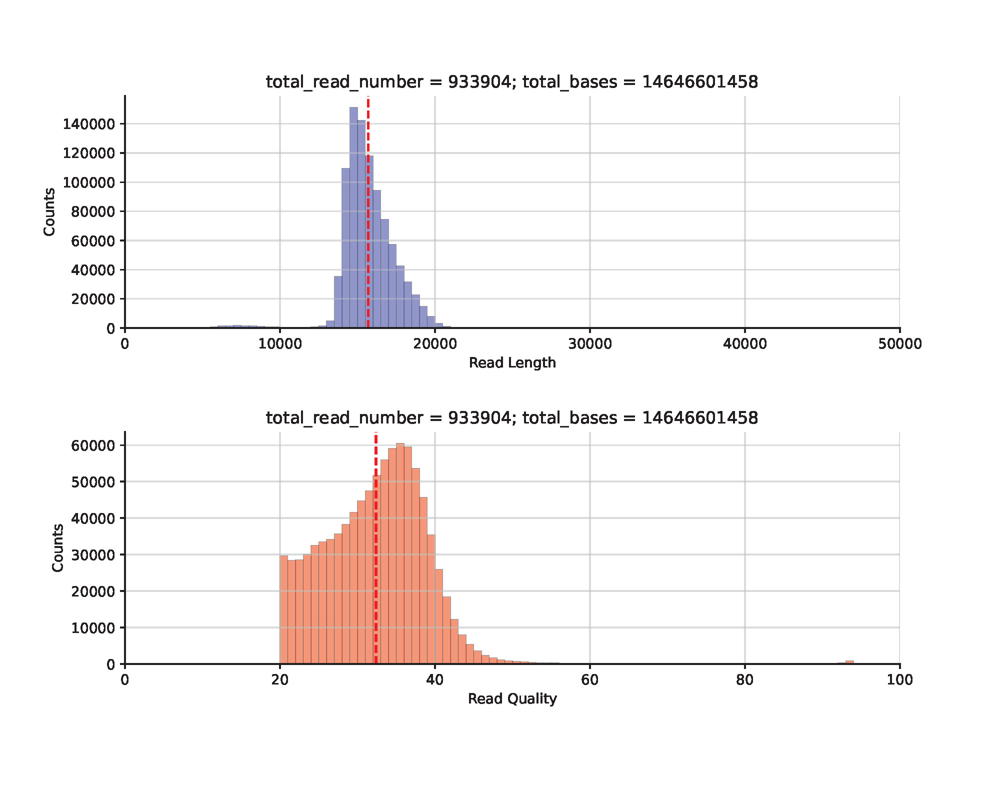 |  | 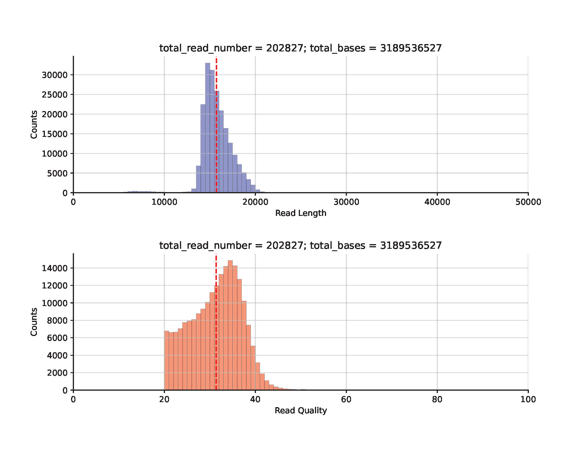 |

#### Calling and calculating the frequencies of SVs, SNVs and small InDels with plotting

```bash
# filter the reads: remove reads shorter than 10 kb
python filt_read_ids.py /mnt/software/scripts/hifisr/deps/soft_paths.txt ATHiFi001 mito_id_length_qual.txt plastid_id_length_qual.txt 10000 0

# random sampling of 4000 reads for mitochondrial and plastid genomes, respectively
python sample_reads.py /mnt/software/scripts/hifisr/deps/soft_paths.txt ATHiFi001 mito filt_L10K_mito_id_length_qual.txt 4000
python sample_reads.py /mnt/software/scripts/hifisr/deps/soft_paths.txt ATHiFi001 plastid filt_L10K_plastid_id_length_qual.txt 4000

# Estimation of variant frequencies
python get_variants_in_reads.py /mnt/software/scripts/hifisr/deps/soft_paths.txt ATHiFi001 mito run_1 /mnt/software/scripts/results/mito_rotated_293434.fasta /mnt/software/scripts/results/ATHiFi001/reads/sample_reads/sample_4000_mito.fastq 32
python get_variants_in_reads.py /mnt/software/scripts/hifisr/deps/soft_paths.txt ATHiFi001 plastid run_1 /mnt/software/scripts/results/plastid_rotated_61049.fasta /mnt/software/scripts/results/ATHiFi001/reads/sample_reads/sample_4000_plastid.fastq 32
```

| mitochondria                                                           | plastid                                                                   |
| ---------------------------------------------------------------------- | ------------------------------------------------------------------------- |
| 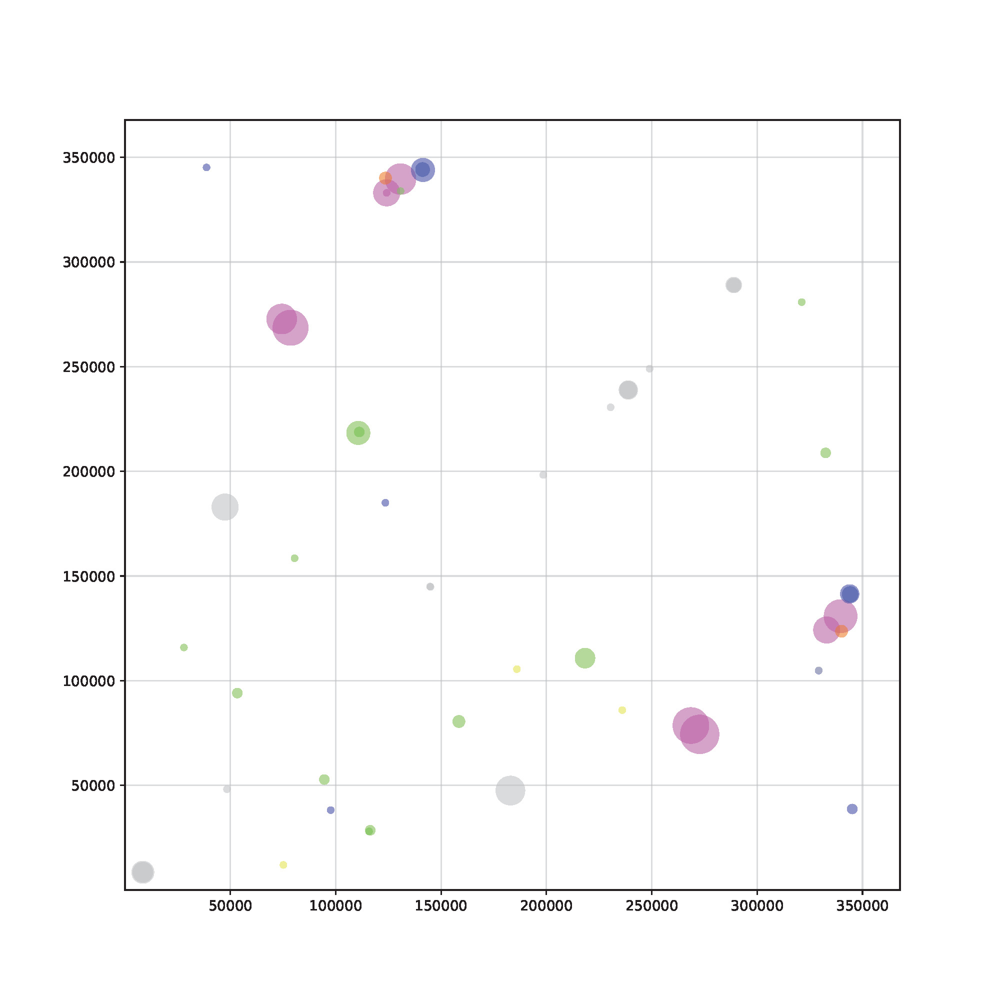 | 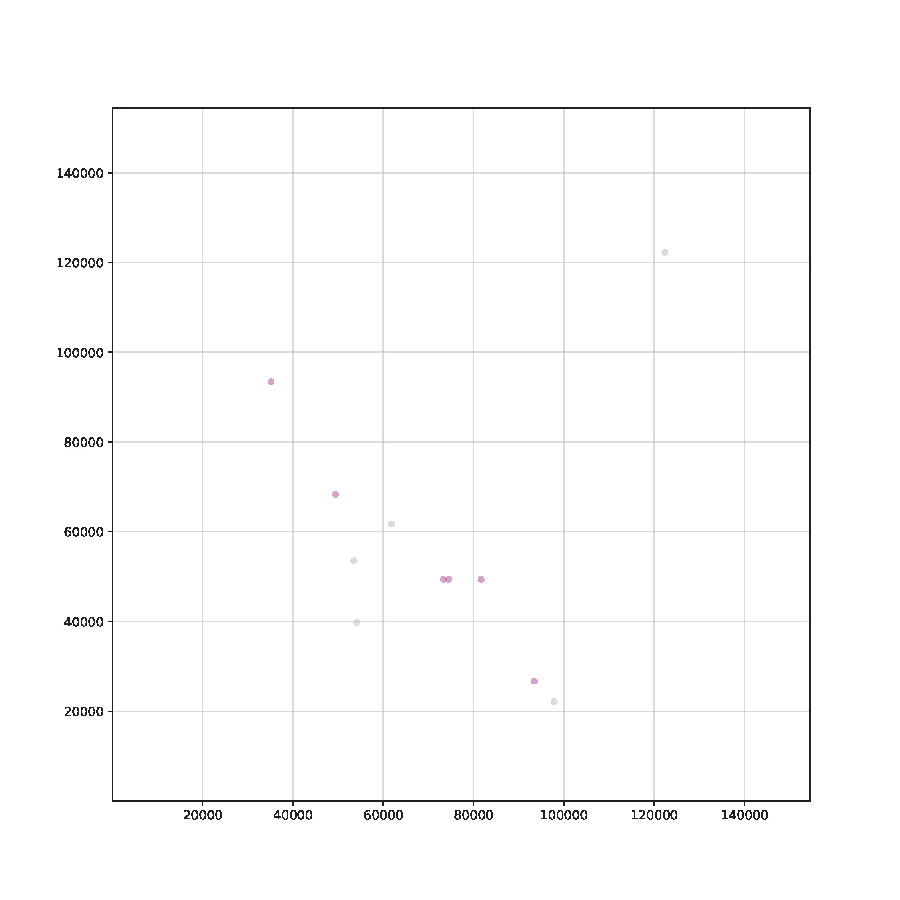 |
|                    | 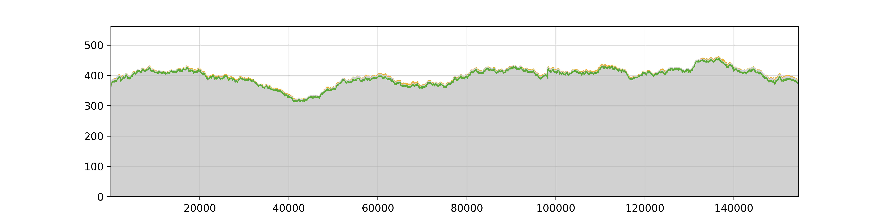                   |

### Example 2: *Amborella trichopoda* (var. Santa Cruz 75)

#### Prepare the reference sequences of mitochondrial and plastid genomes

```bash
# create your working folder
mkdir -p /mnt/software/scripts/results && cd /mnt/software/scripts/results
# create a folder ref to store the references
mkdir ref && cd ref
# Download the references for mt genome: KF754799.1_mt_5.fasta, KF754800.1_mt_4.fasta, KF754801.1_mt_3.fasta, KF754802.1_mt_2.fasta, KF754803.1_mt_1.fasta.
# Concatenate the files 
cat KF754799.1_mt_5.fasta KF754800.1_mt_4.fasta KF754801.1_mt_3.fasta KF754802.1_mt_2.fasta KF754803.1_mt_1.fasta > mt_all.fasta
# Download the references for pt genome: AJ506156.2_pt.fasta
# rotate the pt reference
python adjust_ref_fasta.py /mnt/software/scripts/hifisr/deps/soft_paths.txt plastid AJ506156.2_pt.fasta
```

#### Prepare the reads (fastq format)

Analysis of the *Amborella trichopoda* dataset (var. Santa Cruz 75) ([SRR28888927](https://www.ncbi.nlm.nih.gov/sra/SRR28888927), 33.1 Gb, [Carey et al., 2025, Nature Plants](https://www.nature.com/articles/s41477-024-01858-x))

```bash
# Download the data as SRR28888927.1.fastq.gz
python get_mtpt_reads.py /mnt/software/scripts/hifisr/deps/soft_paths.txt Amborella_1 /mnt/software/scripts/results/mt_all.fasta /mnt/software/scripts/results/AJ506156.2_pt.fasta /mnt/software/scripts/results/SRR28888927.1.fastq.gz 32
```

| All                                                       | mitochondria                                                        | plastid                                                           |
| --------------------------------------------------------- | ------------------------------------------------------------------- | ----------------------------------------------------------------- |
| 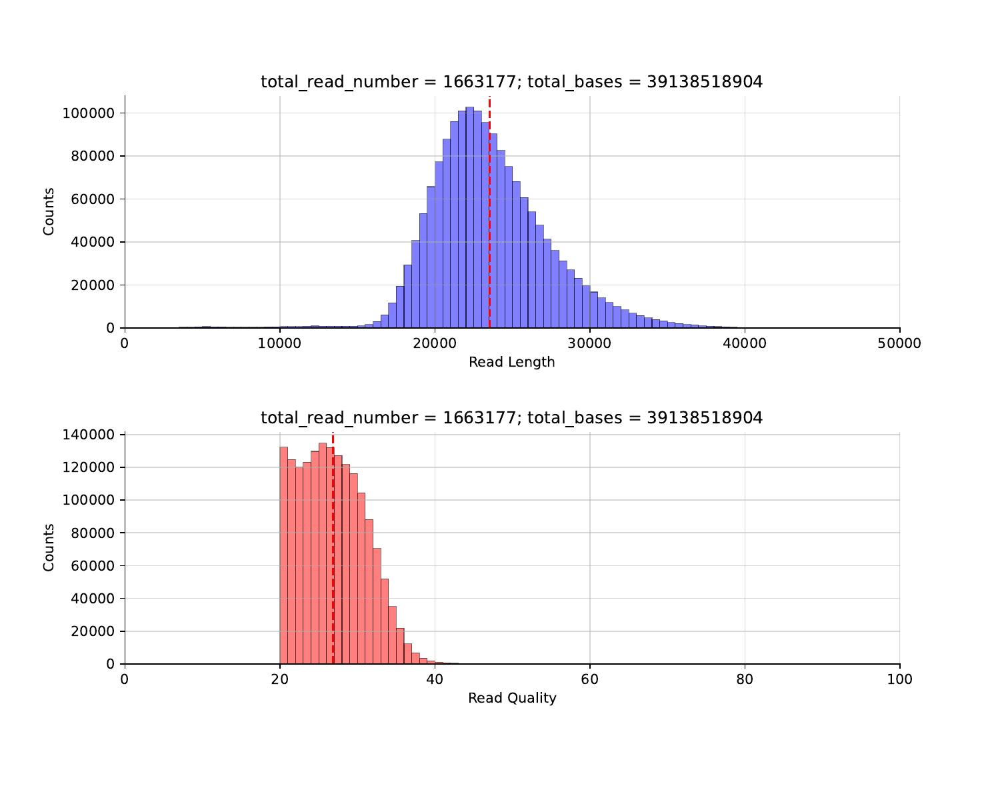 | 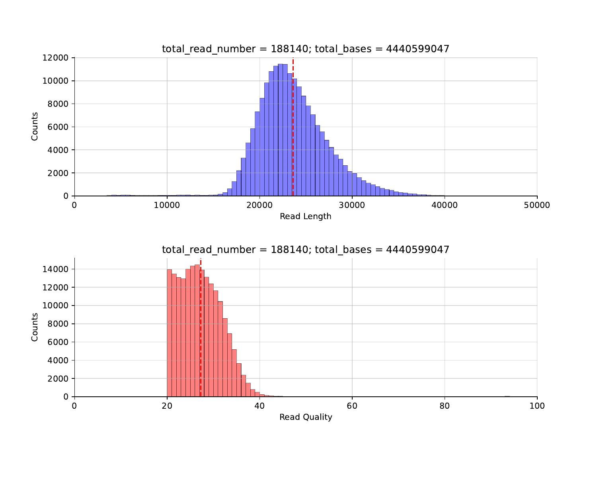 | 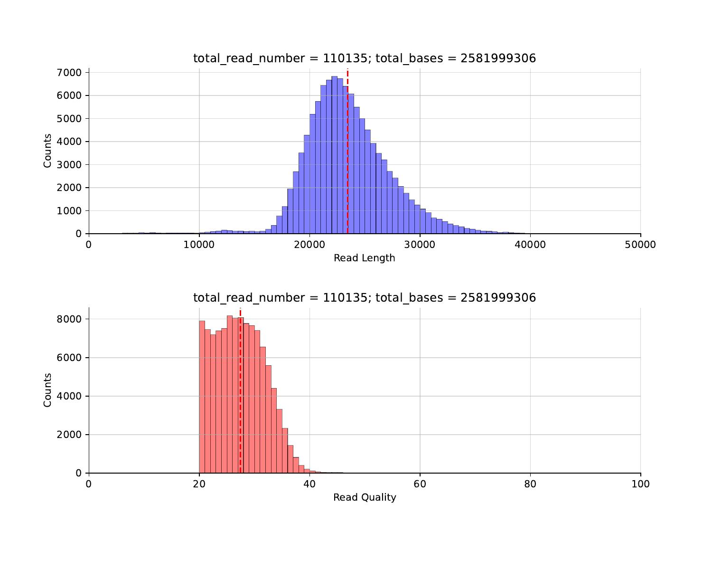 |

#### Get the draft assembly of mitochondrial genome

```bash
# filter the reads: remove reads shorter than 10 kb
python filt_read_ids.py /mnt/software/scripts/hifisr/deps/soft_paths.txt Amborella_1 mito_id_length_qual.txt plastid_id_length_qual.txt 10000 0

# random sampling of 10000 reads for mt genome
python sample_reads.py /mnt/software/scripts/hifisr/deps/soft_paths.txt Amborella_1 mito filt_L10K_mito_id_length_qual.txt 10000

# get the draft assembly
python get_draft_assembly.py /mnt/software/scripts/hifisr/deps/soft_paths.txt Amborella_1 mito mt_all.fasta sample_10000_mito.fastq 20
```

| MECAT2 + metaFlye                                         | metaFlye                                                |
| --------------------------------------------------------- | ------------------------------------------------------- |
| 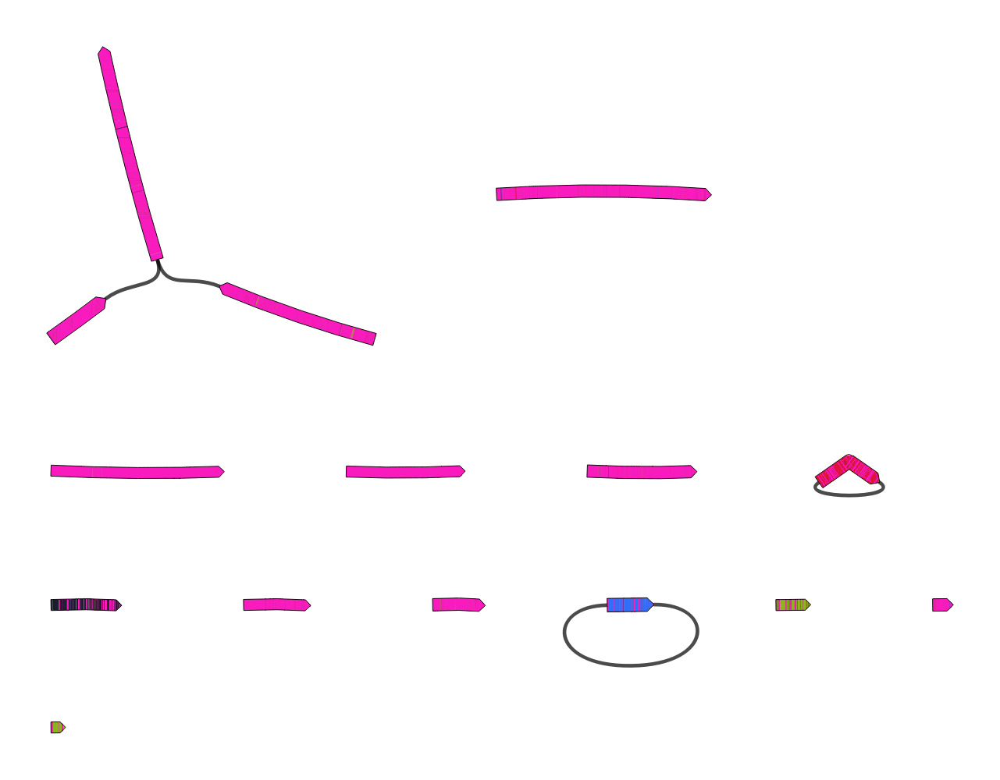 | 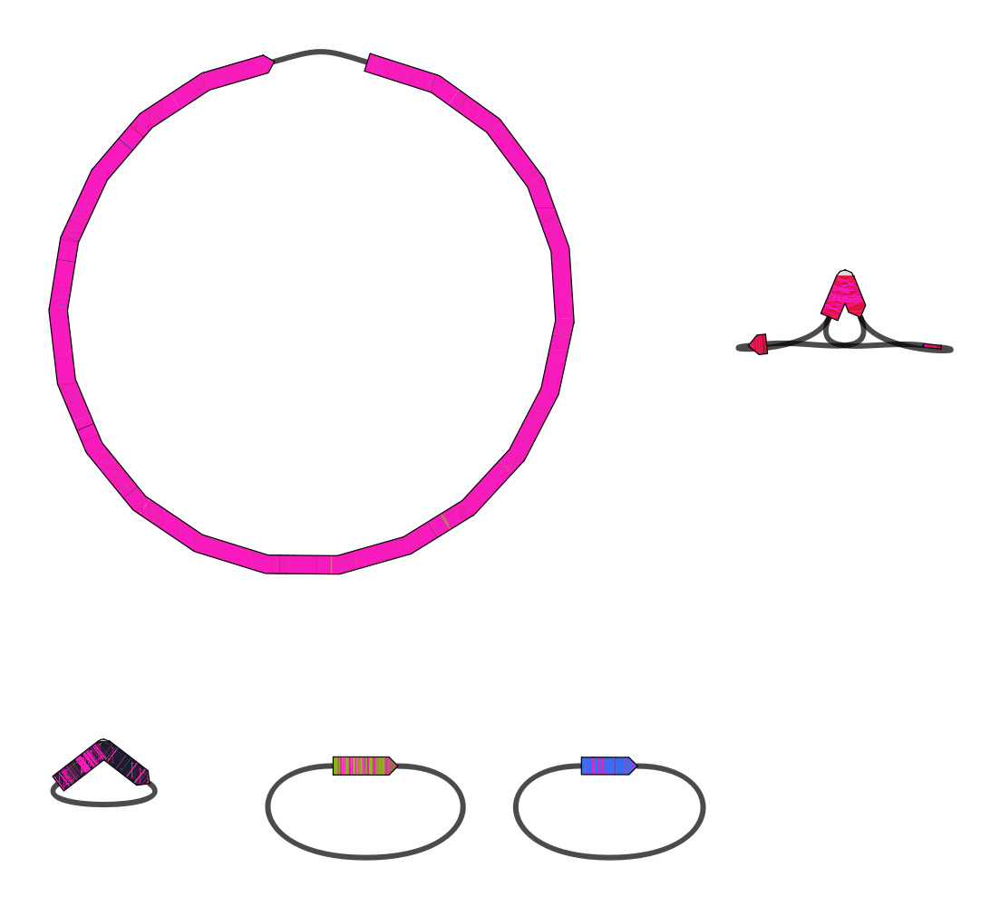 |
| 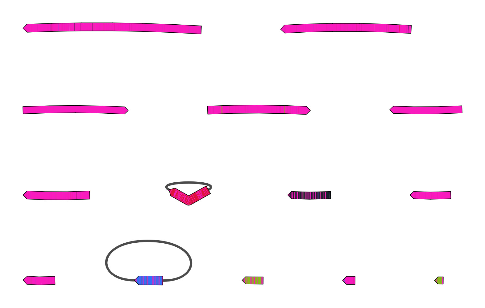   | 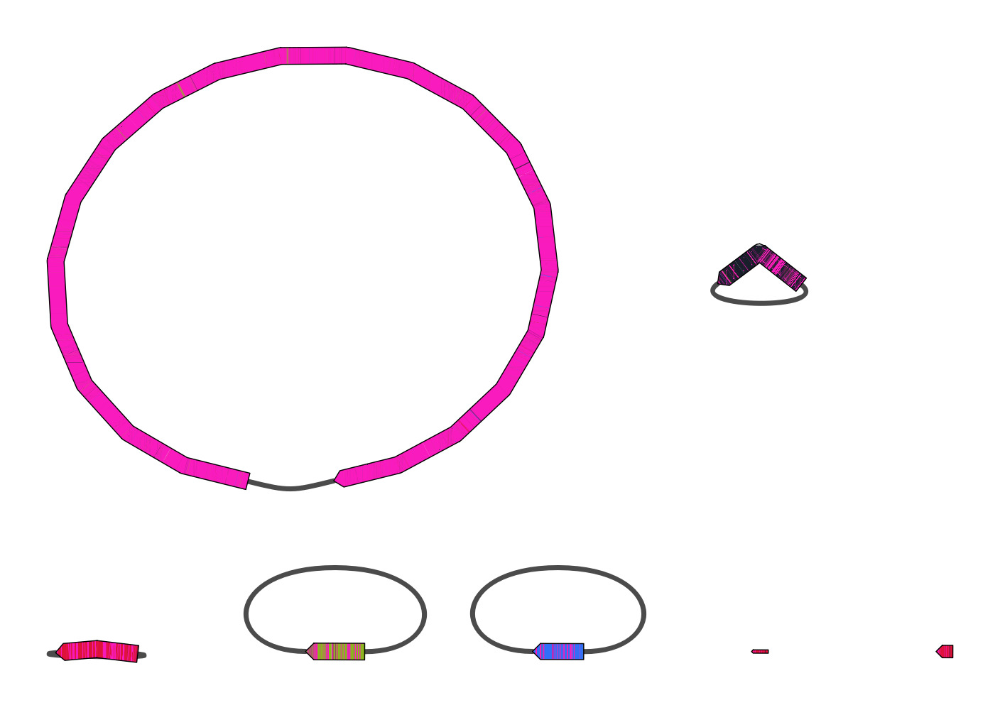   |

#### Choose the assembly (upper right, metaFlye before repeat resolution, and without running MECAT2) for downstream analysis

```bash
# Manually resolve the graph in Bandage, and save the results as draft.fasta
# Split the reads by contig
python get_reads_by_contig.py /mnt/software/scripts/hifisr/deps/soft_paths.txt Amborella_1 mt_draft_contigs draft.fasta sample_10000_mito.fastq 32

# Check the correctness of the contigs by calling and calculating variant frequencies
python get_variants_in_reads.py /mnt/software/scripts/hifisr/deps/soft_paths.txt Amborella_1 mito contig_1 contigs.part_contig_1.fa contig_1.fastq 32
python get_variants_in_reads.py /mnt/software/scripts/hifisr/deps/soft_paths.txt Amborella_1 mito contig_2 contigs.part_contig_2.fa contig_2.fastq 32
python get_variants_in_reads.py /mnt/software/scripts/hifisr/deps/soft_paths.txt Amborella_1 mito contig_3 contigs.part_contig_3.fa contig_3.fastq 32
python get_variants_in_reads.py /mnt/software/scripts/hifisr/deps/soft_paths.txt Amborella_1 mito contig_4 contigs.part_contig_4.fa contig_4.fastq 32
python get_variants_in_reads.py /mnt/software/scripts/hifisr/deps/soft_paths.txt Amborella_1 mito contig_5 contigs.part_contig_5.fa contig_5.fastq 32

# Manually correct the small errors contig_1, contig_2, contig_3 based on the results
```

#### Correct contig_4

```bash
# Re-assemble contig_4 separately
python get_draft_assembly.py /mnt/software/scripts/hifisr/deps/soft_paths.txt Amborella_1 mito contig_4.fastq 32

# Manually resolve the graph in Bandage, and save the results as contig_4_v2.fasta
# Polish the assembly and align it to KF754801.1_mt_3.fasta
python get_polished_assembly.py /mnt/software/scripts/hifisr/deps/soft_paths.txt Amborella_1 mito KF754801.1_mt_3.fasta contig_4_v2.fasta contig_4.fastq 32

# Check the correctness again
python get_variants_in_reads.py /mnt/software/scripts/hifisr/deps/soft_paths.txt Amborella_1 mito contig_4_v2 mito_flye_polish_aligned.fasta contig_4.fastq 32
```

| Coverage in Round 1                                        | Coverage in Round 2                                        |
| ---------------------------------------------------------- | ---------------------------------------------------------- |
| 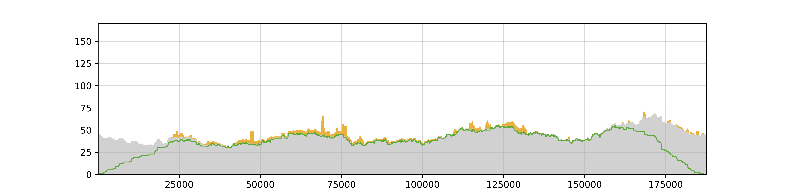 | 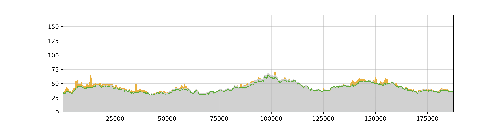 |

#### Correct contig_5

```bash
# Re-assemble contig_5 separately
mkdir -p Amborella_1/hifiasm_results && cd Amborella_1/hifiasm_results
/mnt/software/scripts/hifisr/deps/hifiasm/hifiasm -o contig_5_hifiasm -t 32 contig_5.fastq
cd ../..

# Manually resolve the graph in Bandage, and save the results as contig_5_hifiasm_p_ctg.fasta
# Check the structural correctness of contig_5_hifiasm_p_ctg.fasta
python get_variants_in_reads.py /mnt/software/scripts/hifisr/deps/soft_paths.txt Amborella_1 mito contig_5_hifiasm_p_ctg contig_5_hifiasm_p_ctg.fasta contig_5.fastq 32

# Polish the assembly and align it to KF754799.1_mt_5.fasta, using only the fully-aligned reads
python get_polished_assembly.py /mnt/software/scripts/hifisr/deps/soft_paths.txt Amborella_1 mito KF754803.1_mt_1.fasta contig_5_hifiasm_p_ctg.fasta FL.fasta 32

# Check the correctness of the polished assembly
python get_polished_assembly.py /mnt/software/scripts/hifisr/deps/soft_paths.txt Amborella_1 mito contig_5_hifiasm_p_ctg_run_2 mito_flye_polish_aligned.fasta contig_5.fastq 32
# Manually correct the small errors based on the results, and check the correctness again
python get_polished_assembly.py /mnt/software/scripts/hifisr/deps/soft_paths.txt Amborella_1 mito contig_5_hifiasm_p_ctg_run_3 mito_flye_polish_aligned_cor.fasta contig_5.fastq 32
```

| Coverage in Round 1                                        | Coverage in Round 2                                        |
| ---------------------------------------------------------- | ---------------------------------------------------------- |
| 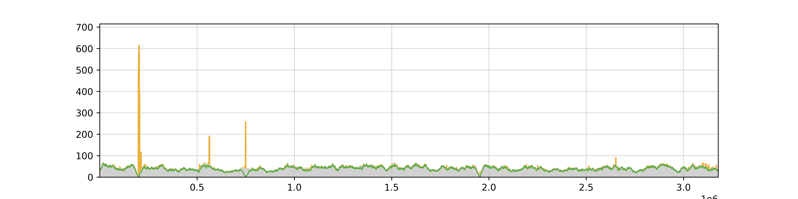 | 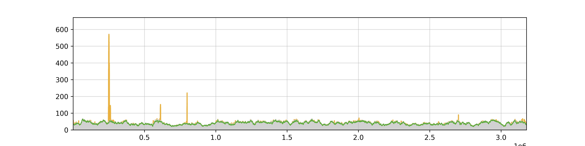 |

| Coverage in Round 3                                        | Coverage in Round 4                                        |
| ---------------------------------------------------------- | ---------------------------------------------------------- |
|  | 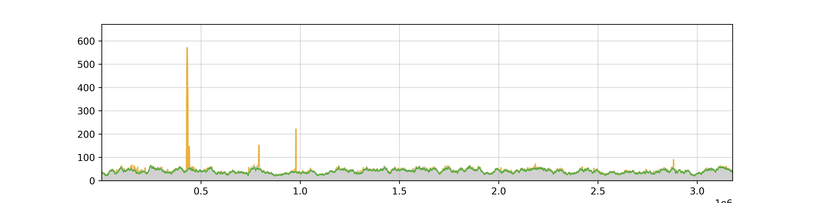 |

## Citations

1. Yi Zou, Weidong Zhu, Daniel B. Sloan, Zhiqiang Wu. (2022). Long-read sequencing characterizes mitochondrial and plastid genome variants in *Arabidopsis msh1* mutants. *The Plant journal* *112* (3), 738–755. https://doi.org/10.1111/tpj.15976
2. Yi Zou, Weidong Zhu, Yingke Hou, Daniel B. Sloan, Zhiqiang Wu. (2025). The evolutionary dynamics of organellar pan-genomes in *Arabidopsis thaliana*. *bioRxiv* 2025.01.20.633836; doi: https://doi.org/10.1101/2025.01.20.633836
